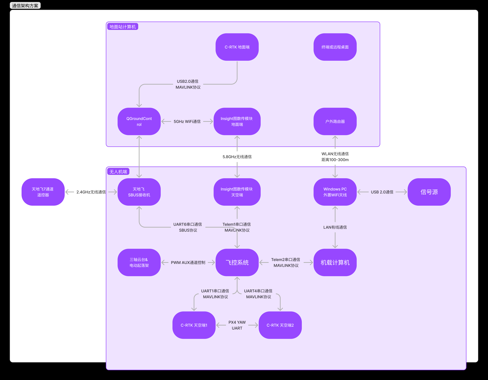
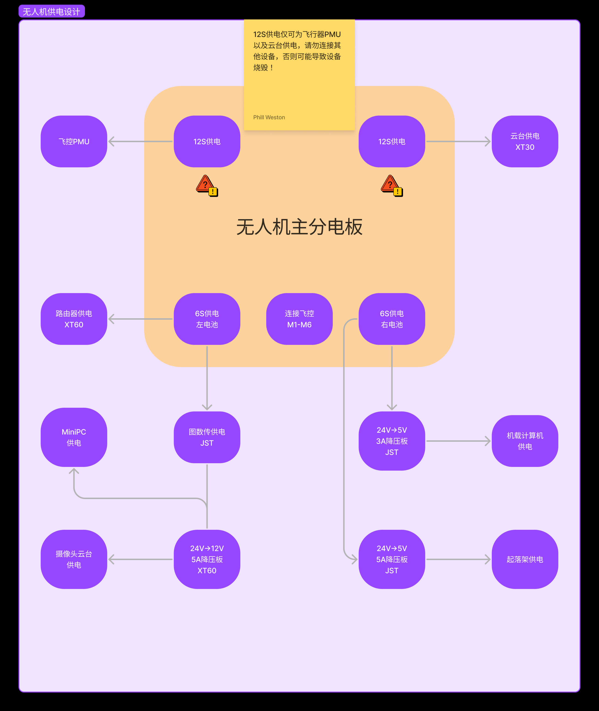

# Antenna-Tracking-Drone-Project

## Description

这是一个与电院天线所合作的项目，由501实验室的研发学生Phillweston与Devotlig负责联合开发基于pixhawk的无人机飞行与云台控制以及空地通信的部分，由天线所的研究团队负责负载设备的设计与数据处理。

## Project Structure

详情请参考notion知识库链接：

[六旋翼无人机开发项目](https://phillweston.notion.site/a2cea4024b174a9db5cb346bafad33eb)

### Communication Structure

### Power Structure

## Hardware

- 飞控硬件：雷迅V5+，NEO V2 GPS
- 机载计算机：树莓派4
- 图数传：Insight HDMI高清数字图数传
- 遥控和接收设备：天地飞7 + SBUS接收机
- 云台：三轴无刷云台，SBUS串口控制
- 负载设备：信号源 + 一对偶极子天线
- WiFi通信设备：wavlink 600M 户外路由器 + tplink 150M USB无线网卡

## Software

- 飞控软件：Ardupilot
- 机载计算机系统：待指定
- MiniPC系统：Windows 10 专业版

## Function

以下功能均在地面站计算机上面实现

- [ ] 三轴云台控制
- [x] 航点生成
- [ ] 图形界面

## Testing

测试功能在F450飞机上面完成，确定无误后在大飞机上面做复现。

## Maintenance

- Project Owner: Phillweston
- Copilot: Devotlig

## Progress

9月27日更新，增加csv航点导入支持。

10月21日，完成生成锅盖的功能。